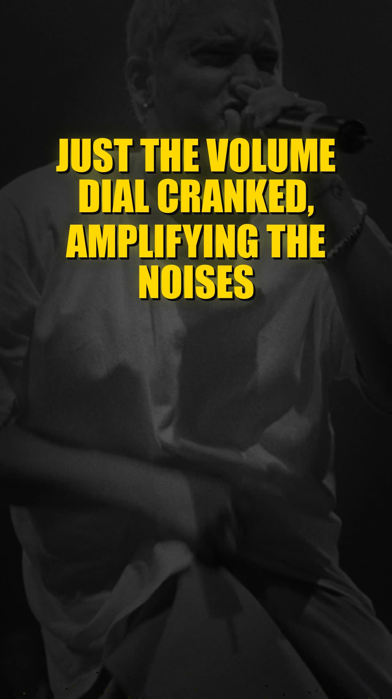

# kinetic-lyrics

A Claude Code skill that generates kinetic typography lyric videos from any MP3. Drop in a song, get a Shorts-ready video with perfectly timed lyrics.

## What it does

1. Transcribes your MP3 with Whisper to get word-level timestamps
2. Claude aligns and cleans up the lyrics (fixes Whisper's mishearings)
3. Optionally fetches the artist's photo from Wikipedia for the background
4. Renders a 9:16 vertical video with glowing text, particles, Ken Burns backgrounds, and smooth fade transitions

Works with just an MP3 (Claude cleans up Whisper's output) or MP3 + lyrics file for perfect accuracy.

## Example output

<p align="center">
  <a href="https://youtu.be/WnLsf9lLhKs">
    
  </a>
</p>

<p align="center">
  <a href="https://youtu.be/WnLsf9lLhKs">Watch the full video on YouTube</a>
</p>

*AI-generated Eminem track with Wikipedia artist background, gold text, Ken Burns effect*

## Quick start

```bash
# Install dependencies
pip install openai-whisper moviepy pillow numpy
brew install ffmpeg

# Copy the skill to your project
mkdir -p .claude/skills
cp kinetic-short.md .claude/skills/
cp kinetic.py fetch_artist_image.py ./

# Run it
claude
> /kinetic-short path/to/song.mp3
```

## Usage

```
/kinetic-short song.mp3
/kinetic-short song.mp3 --lyrics lyrics.txt
/kinetic-short song.mp3 --artist "Juice WRLD"
```

**MP3 only:** Whisper transcribes, Claude fixes mishearings using context. Good enough for most songs.

**MP3 + lyrics:** Perfect alignment. Whisper provides timestamps, real lyrics provide the text.

**With artist name:** Fetches the artist's Wikipedia photo for a Ken Burns background instead of plain black.

## Output

- 1080x1920 (9:16) vertical video, ready for YouTube Shorts or TikTok
- h264/yuv420p with `+faststart` for YouTube compatibility
- Glowing text with drop shadows and particle effects
- Ken Burns zoom/pan on background images with cross-dissolve transitions

## Customization

Edit the render call in the skill to change:

| Option | Default | Description |
|--------|---------|-------------|
| `colors` | `#FFD700` (gold) | Comma-separated hex colors, cycles per phrase |
| `font_size_base` | `95` | Relative font size |
| `text_position` | `"upper"` | `"upper"`, `"center"`, or a float (0.0-1.0) |
| `width` x `height` | 1080x1920 | Resolution. Use 1920x1080 for landscape |

## Files

| File | Description |
|------|-------------|
| `kinetic-short.md` | The Claude Code skill definition. Copy to `.claude/skills/` |
| `kinetic.py` | The renderer. Handles transcription, phrase grouping, and video rendering |
| `fetch_artist_image.py` | Fetches artist photos from Wikipedia for backgrounds |

## Requirements

- Python 3.9+
- ffmpeg
- openai-whisper
- moviepy
- pillow
- numpy
- certifi (optional, for SSL on some systems)

## How it works

The hard part of kinetic lyrics videos is timing. Whisper gives you timestamps but gets words wrong. Lyrics files give you words but no timestamps. This skill uses both: Whisper for timing, Claude's judgment for the actual text.

When you don't have lyrics, Claude uses context to fix Whisper's mistakes. For example, in a Gucci Mane track, Whisper hears "I'm a noodle" but Claude knows it's "ramen noodles" from the trap music context.

The renderer uses PIL for text with glow effects and moviepy for video assembly. No GPU required.
